<div align="center">

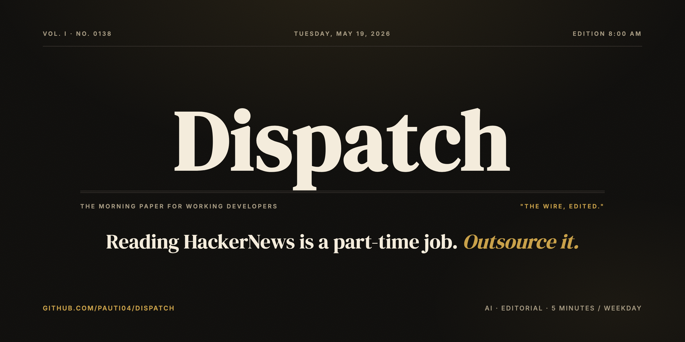

# Dispatch

**An AI-curated daily morning brief for working developers.**
Editorial voice. Career-grounded curation. Five minutes, five things, four hundred ignored.

[](https://vitejs.dev)
[](https://react.dev)
[](https://tailwindcss.com)
[](https://expressjs.com)
[](https://neon.tech)
[](https://platform.openai.com)
[](https://resend.com)
[](https://sentry.io)
[](https://posthog.com)
[](https://expo.dev)

</div>

---

## What it looks like

> The product is a newspaper, redrawn for software. Ink (#0d0c0a) on cream, gold accents, double-ruled mastheads, "Vol. I · No. xxxx" issue numbering. Print typography on the screen.

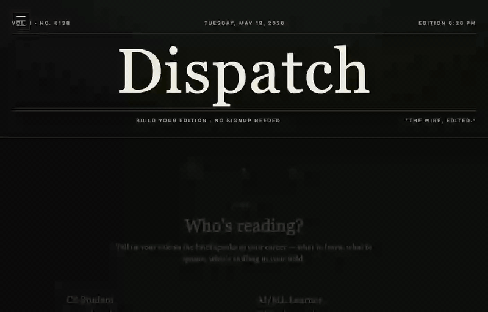

*Role-first onboarding → live streaming brief generation via Server-Sent Events. From submit to first headline is ~800ms.*

---

## Table of contents

- [What it is](#what-it-is)
- [The annotated demo](#the-annotated-demo)
- [By the numbers](#by-the-numbers)
- [Stack](#stack)
- [Architecture](#architecture)
- [Interesting choices](#interesting-choices)
- [Local development](#local-development)
- [Documentation](#documentation)
- [Project history](#project-history)
- [Screenshots](#screenshots)

---

## What it is

Dispatch is a solo-built end-to-end product. The wedge:

| Pillar | What it means |
|---|---|
| **Editorial brand, not a SaaS dashboard** | DM Serif Display + Crimson Pro, ink/cream/gold, double-ruled mastheads, issue numbering. Looks like a newspaper because it *is* a newspaper. |
| **Career-grounded curation, not entertainment-grounded** | Every story carries a "why it matters" line tied to the reader's role + the actual hiring signal underneath (pulled from monthly HN "Who is hiring" + Layoffs.fyi). |
| **Voice over volume** | The brief picks five things and ignores four hundred. *The Editor's Take* field forces the model to commit to a position. 25+ explicit BAD/GOOD voice examples in the prompt — the voice gets sharper every week as real failure modes get catalogued. |
| **Less, on purpose** | No doomscroll. No infinite feed. No ads. Five minutes, one email per weekday, then the product is over until tomorrow. |

---

## The annotated demo

<div align="center">
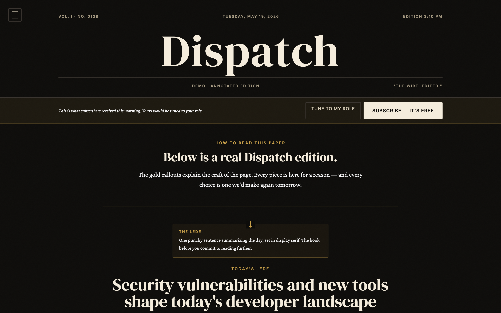
</div>

`/demo` is the canonical front door. A real Dispatch edition rendered with editorial callouts that teach the reader the craft of the page as they scroll — Lede, Editor's Note, Editor's Pick, Pull Quote, Why-it-matters line. Ends with a "what just happened" reveal showing pool-size + generation time + subscribe CTA.

New visitors see VALUE before being asked for commitment.

---

## By the numbers

<div align="center">

| Metric | Count |
|:---:|:---:|
| **Build waves shipped** | 14 (A–N + Wave M strategic) |
| **DB migrations** | 19 |
| **Frontend routes** | 30+ (24 SPA + 6 SSR'd for crawlers) |
| **Backend endpoints** | 40+ |
| **Content sources** | 8 |
| **LLM models in play** | 6 |
| **Ship surfaces** | 3 (web + Expo mobile + Chrome MV3 extension) |
| **OpenAI cost at 100 users** | ~$15/mo |
| **Initial JS bundle** | 92 KB gzipped (lazy-loaded PostHog dropped 61 KB) |

</div>

The 8 sources: HackerNews · GitHub Trending · Lobsters · Reddit · arXiv · Show HN · Who's Hiring · Layoffs.fyi.

The 6 LLM models: writer (gpt-4o-mini) · LLM-as-judge · embeddings (text-embedding-3-small) · TTS (gpt-4o-mini-tts) · editor's-pick deep-dive · A/B prompt variants.

---

## Stack

<table>
<tr>
<td valign="top" width="50%">

**Frontend**
- Vite + React 18 + Tailwind
- React Router (30+ routes, 6 SSR'd)
- PWA with maskable icon
- Inter / Crimson Pro / DM Serif Display
- SSE EventSource for streaming briefs

**Backend**
- Express on Node
- Magic-link auth via signed JWT cookies
- Per-IP + per-email rate limiting
- Sentry + PostHog observability
- One-shot Render Blueprint config

</td>
<td valign="top" width="50%">

**Database**
- Neon Postgres (serverless)
- 19 migrations
- tsvector full-text search
- JSONB for edition data + attribution
- All FKs cascade correctly on user delete

**AI / LLMs**
- gpt-4o-mini for writer + judge + deep-dive
- text-embedding-3-small pre-filter (cuts cost ~70%)
- gpt-4o-mini-tts for audio editions
- A/B prompt variants in `prompt_variants` registry
- LLM-as-judge scoring → `brief_scores`

</td>
</tr>
<tr>
<td valign="top">

**Email + delivery**
- Resend with table-based HTML
- Plain-text fallback for every template
- Custom-domain DKIM/SPF/DMARC docs
- Hourly cron handles per-timezone delivery
- Idempotent via `(user_id, edition_date)` constraint

</td>
<td valign="top">

**Mobile + extension**
- Expo (React Native) — magic-link auth, brief screen, Expo push
- Chrome MV3 new-tab override extension
- Both share the same backend API
- Slack OAuth + daily channel poster

</td>
</tr>
</table>

---

## Architecture

```
                          ┌────────────────────────────────────────┐
   visitor ──► / ───────► │ Landing → /demo (annotated edition)    │
                          │   │                                    │
                          │   ▼                                    │
                          │ /try (role + skill + beats)            │
                          │   │  POST /api/brief/stream (SSE)      │
                          │   ▼                                    │
                          │ /signup → /verify → /account           │
                          └────────────────────────────────────────┘

  Server (Render)                                       Cron (Render)
  ┌─────────────────────────┐                     ┌───────────────────┐
  │ Express                 │                     │ runDispatchHour() │
  │  /api/brief, sample,    │ ◄───────────────────┤  every hour       │
  │  auth, me, editions,    │                     │ runWeeklyReview() │
  │  admin, slack, push,    │                     │  Sunday 09:00     │
  │  feed, OG, TTS          │                     └───────────────────┘
  │                         │                     ┌───────────────────┐
  │ generateBrief() →       │ ──────────────────► │ Resend            │
  │  fetchSourcePool        │                     │  daily email +    │
  │  prefilter (embeddings) │                     │  weekly digest    │
  │  moderate               │                     └───────────────────┘
  │  GPT writer (variant)   │                     ┌───────────────────┐
  │  hydrate                │ ──────────────────► │ Neon Postgres     │
  │  scoreBriefAsync()      │                     │  19 migrations    │
  └─────────────────────────┘                     └───────────────────┘
```

---

## Interesting choices

### 🎙 Editor voice is the moat, not features

The prompt has 25+ explicit BAD/GOOD example pairs for what the editor's voice should and shouldn't sound like. A signature **"The Editor's Take"** field forces the model to commit to a position every brief. Hard to clone in a weekend because it's not feature-shaped — it's accumulated specific-failure-mode tuning.

### 💰 Embeddings pre-filter cut OpenAI cost ~70%

Before the writer call, the source pool (~110 clusters) gets cosine-ranked against the user's beats via `text-embedding-3-small`. Only the top 30 reach the writer model. At 1k users: ~$50/mo vs. ~$200/mo with no pre-filter. Caches beat-embeddings + cluster-title-embeddings in-memory LRU.

### 🔗 Cross-source deduplication, not a feed of feeds

The same story often shows up on HN, GitHub Trending, Lobsters, and Reddit. URL canonicalization clusters them into one card with stacked source tags. The brief never repeats a story.

### 📊 LLM-as-judge for drift detection

Every brief gets a second pass through gpt-4o-mini that scores it 1–5 on coherence, career-relevance, and voice-fidelity. Scores join with a `prompt_variants` registry for A/B testing the prompt itself — winning variants get promoted to default after 100+ scored briefs per variant.

### ⚡ Streaming SSE generation, not a 10-second wait

`/api/brief/stream` is a Server-Sent Events endpoint. The client `EventSource` parser consumes deltas and renders them live in an editorial "Live · composing" pane. From submit to first headline is ~800ms vs. ~8s for the non-streaming variant.

### 🔑 Magic-link auth without a sessions table

Signed JWT in an HTTP-only cookie. No passwords. No sessions table. No password reset flow. Three endpoints: `/auth/request`, `/auth/verify`, `/auth/logout`.

---

## Local development

You'll need three external accounts (all free tier):

1. **Neon** — Postgres. Create a project, copy the pooled connection string.
2. **Resend** — transactional email. Create an account, copy the API key.
3. **OpenAI** — API key for the writer + embeddings + TTS.

```bash
# Backend
cd server
cp .env.example .env   # fill in DATABASE_URL, RESEND_API_KEY, OPENAI_API_KEY, JWT_SECRET, CRON_SECRET
npm install
npm run migrate
npm run dev            # http://localhost:5180

# Frontend (new terminal)
cd client
npm install
npm run dev            # http://localhost:5173
```

> **Dev tip:** with `RESEND_API_KEY` unset, `/api/auth/request` returns the magic link directly in the JSON response so you can finish the loop without a real email.

---

## Documentation

| Doc | What it covers |
|---|---|
| `docs/deploy.md` | Full Neon + Resend + Render + Vercel deploy playbook |
| `docs/day-8-verification.md` | Half-built surface (Mobile / Slack / Audio / Extension) verification checklist |
| `docs/day-10-staging.md` | Staging deploy runbook + cron load test |
| `docs/day-14-cutover.md` | 50-checkbox sign-off before prod cutover |
| `docs/email-domain.md` | Custom-domain DKIM/SPF/DMARC walkthrough for Resend |
| `docs/voice-scoring.md` | The daily editor-voice scoring habit |
| `docs/show-hn-launch.md` | Pre-written Show HN post + likely-comment replies + launch-morning checklist |
| `docs/co-mention-targets.md` | 15-newsletter outreach list with personalized DM drafts |
| `docs/resume-blurb.md` | Pre-written resume copy (short, long, audience-targeted) |
| `docs/video-walkthrough.md` | 90-second screen-recording script |

---

## Project history

Built in 14 waves. Full plan in `~/.claude/plans/splendid-wandering-finch.md`.

<details>
<summary><b>Click to expand the wave-by-wave history</b></summary>

| Wave | Theme | Highlight |
|---|---|---|
| **A** | Content quality | 6 sources + cross-source dedup + hype tags + community takes |
| **B** | UX polish | Streaming SSE generation, PWA, mobile pass |
| **C** | Depth + retention | Archive, bookmarks, Sunday Week-in-Review, callbacks |
| **D** | Distribution | OG images, RSS, invites, share landing |
| **E** | Personal depth | Audio editions, custom topics, beat weights, vacation mode, skills-trending |
| **F** | Editorial depth | Featured comment from HN, editor's-pick deep-dive, weekly Quoted, Letters |
| **G** | Adaptive learning | Click tracking, per-user relevance refinement, send-time optimization |
| **H** | Growth + virality | Beat SEO pages, story OG, referral leaderboard, browser extension |
| **I** | Platform reach | Cross-pub teasers, team share links, Dispatch Reports, Expo mobile scaffold |
| **J** | Quality + cost | Embeddings pre-filter, LLM-as-judge, A/B variants, cost dashboard, moderation |
| **K** | New growth surfaces | Public bookmark profiles, full-text search, Discover feed, Slack OAuth, push |
| **L** | Polish | Real Privacy/Terms, mobile nav drawer, reading progress, keyboard shortcuts, microcopy |
| **M** | startup polish | Annotated /demo, per-role prewarm, manifesto, press kit, founder narrative, nav surgery |
| **N** | Production hardening | Sentry + PostHog + UTM, cost alerts, OpenAI timeouts, welcome email, The Editor's Take, account-deletion E2E test |
| **N+** | Polish + features | Lazy-load PostHog (40% bundle drop), sitemap+robots, admin dashboard, founder note, per-beat RSS, Bluesky+Mastodon share |

</details>

---

## Screenshots

<table>
<tr>
<td width="50%">
<a href="screenshots/01-landing.png">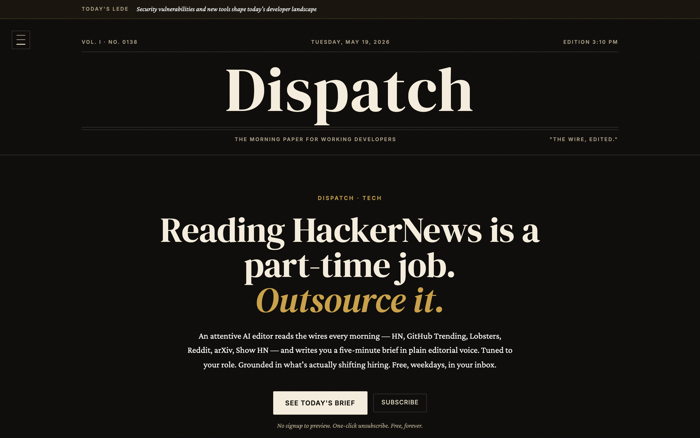</a>
<p align="center"><em>Landing — opinionated hero, sticky lede banner</em></p>
</td>
<td width="50%">
<a href="screenshots/03-demo-annotated.png"></a>
<p align="center"><em>/demo — editorial callouts teach the craft</em></p>
</td>
</tr>
<tr>
<td>
<a href="screenshots/05-try-onboarding.png">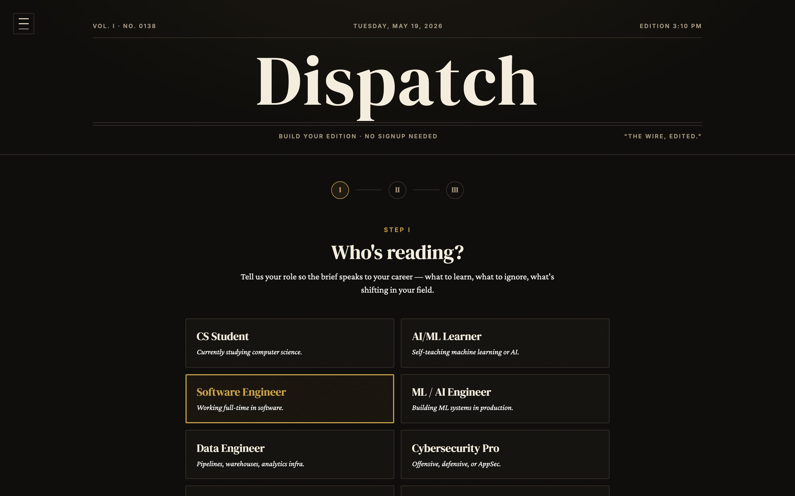</a>
<p align="center"><em>Role-first onboarding in under a minute</em></p>
</td>
<td>
<a href="screenshots/02-landing-anatomy.png">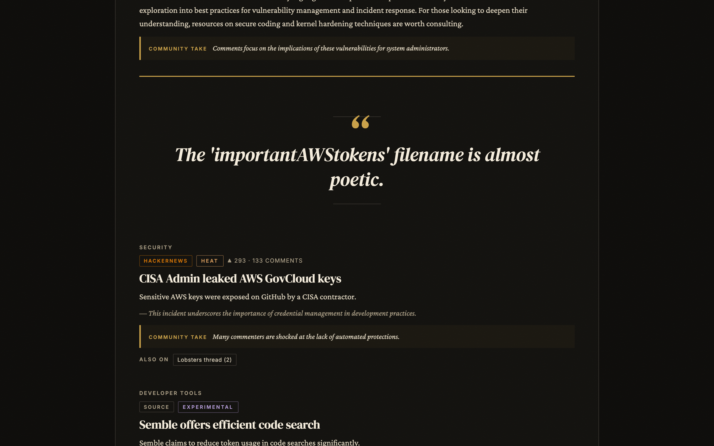</a>
<p align="center"><em>Three-pillar anatomy — Lede, Pick, Pull Quote</em></p>
</td>
</tr>
<tr>
<td>
<a href="screenshots/06-manifesto.png">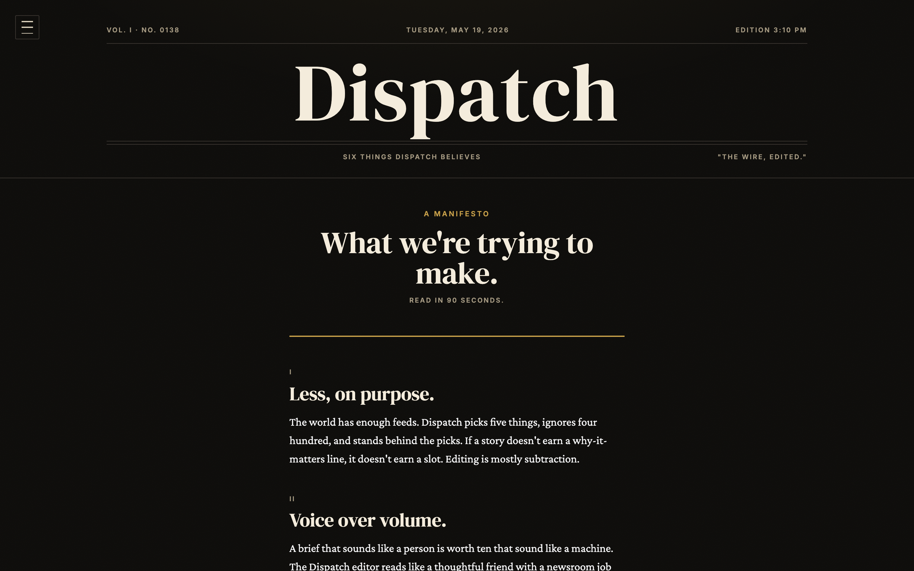</a>
<p align="center"><em>/manifesto — six tenets, 90-second read</em></p>
</td>
<td>
<a href="screenshots/07-press-kit.png">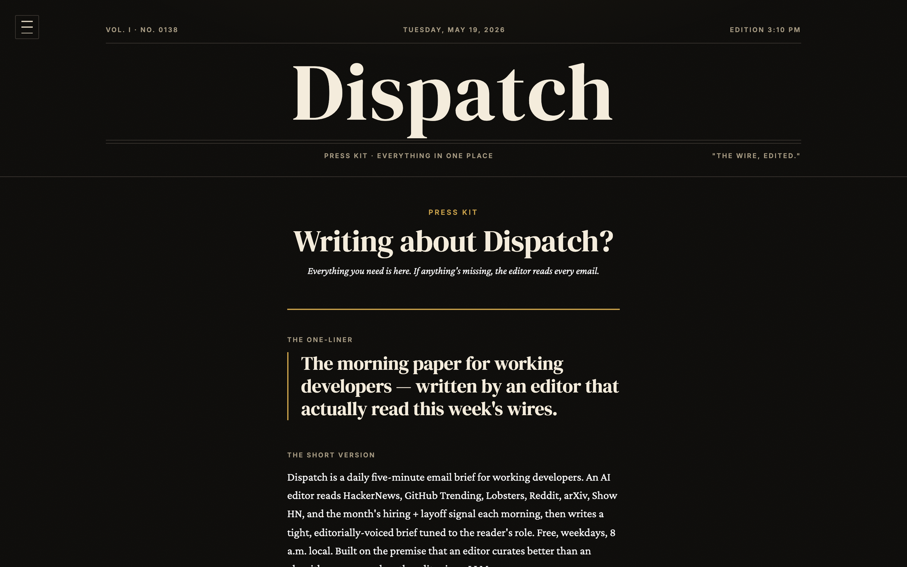</a>
<p align="center"><em>/press — one-pager for press/recruiters</em></p>
</td>
</tr>
<tr>
<td>
<a href="screenshots/08-changelog.png">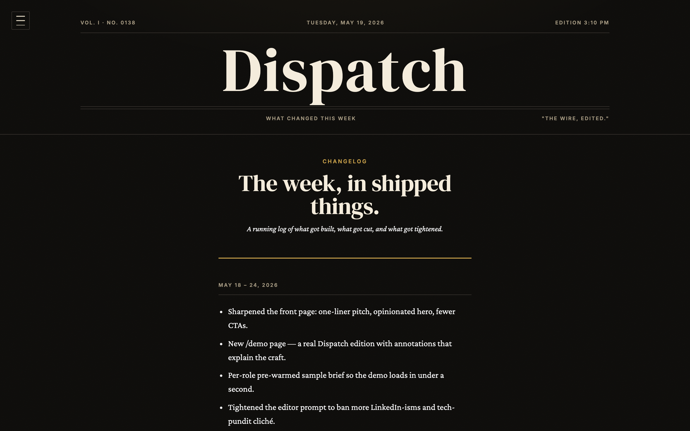</a>
<p align="center"><em>/changelog — public weekly shipped-things log</em></p>
</td>
<td>
<a href="screenshots/00-showcase.png">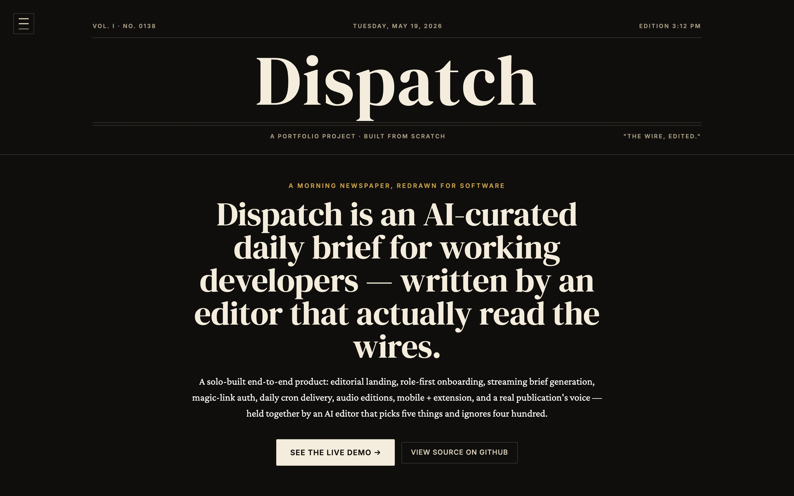</a>
<p align="center"><em>/showcase — the portfolio page itself</em></p>
</td>
</tr>
</table>

### Mobile

<div align="center">
<table>
<tr>
<td>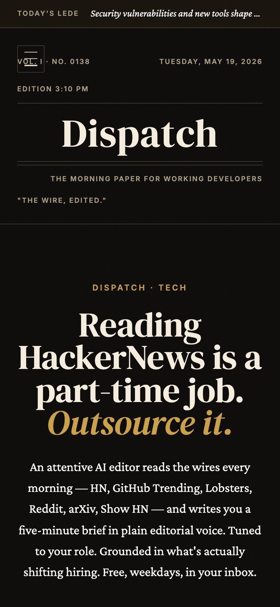</td>
<td>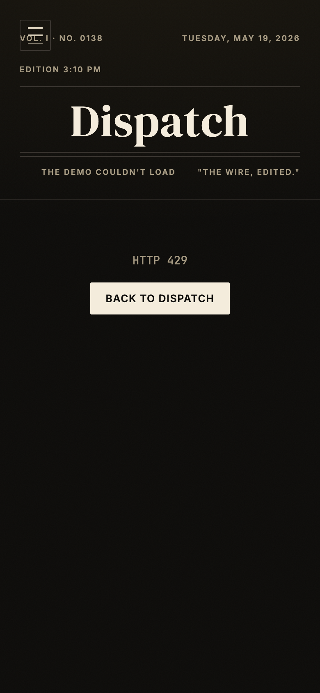</td>
</tr>
</table>
</div>

---

<div align="center">

### Built by [@pauti04](https://github.com/pauti04)

*The wire, edited.*

</div>
